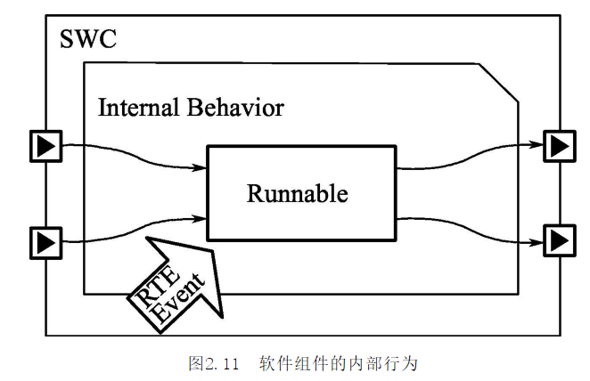
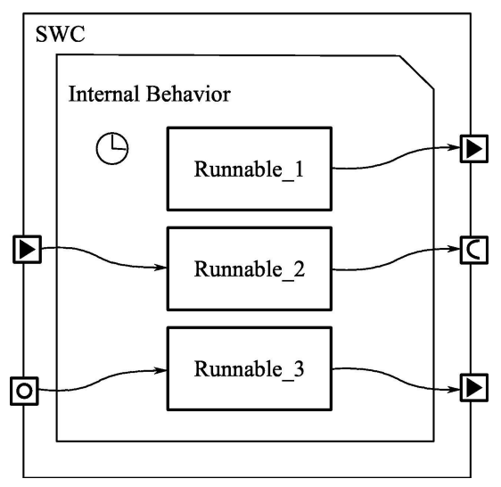
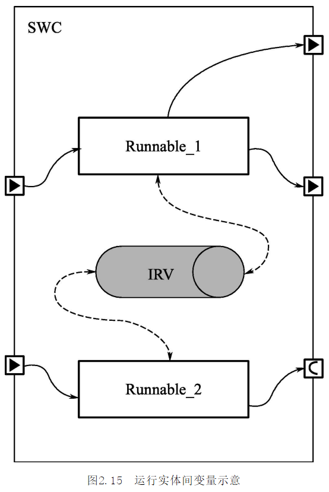
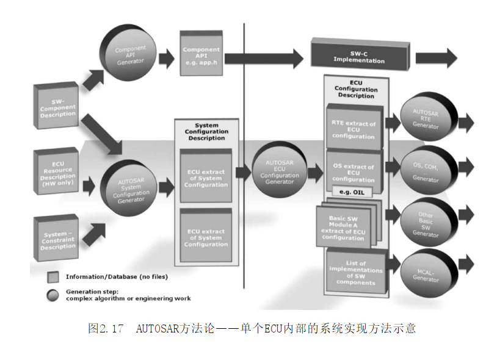
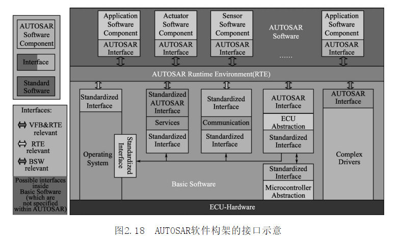
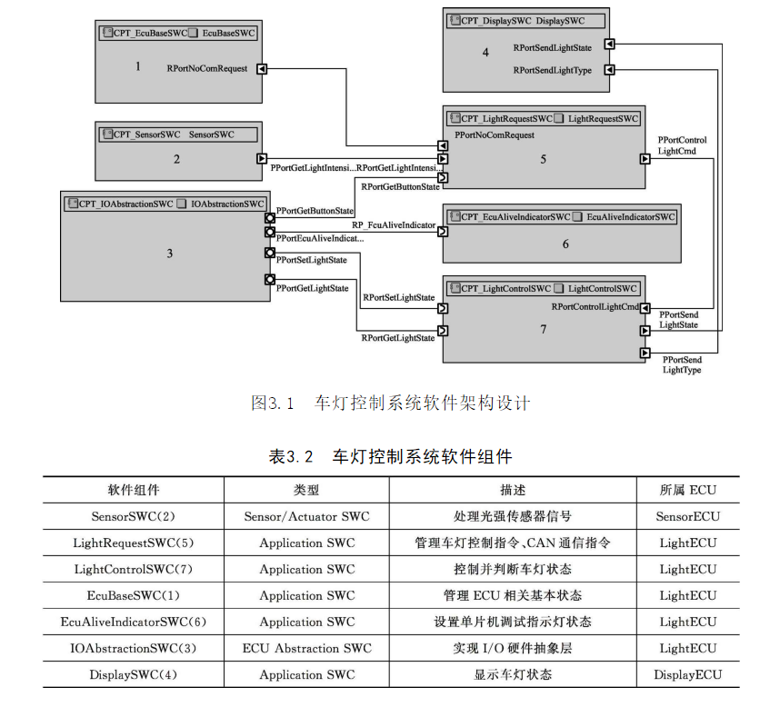
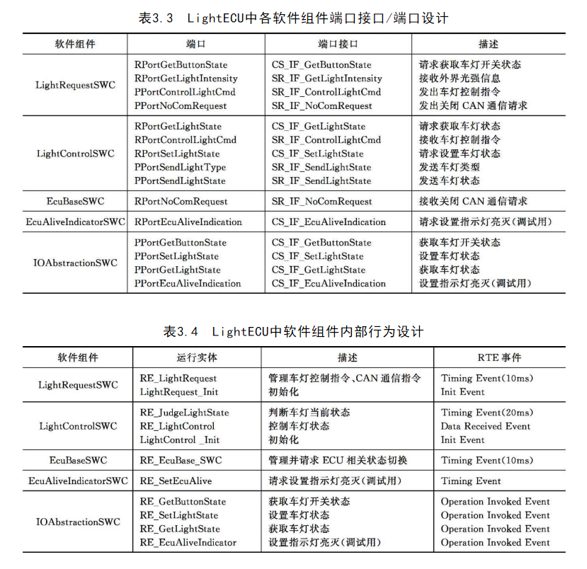
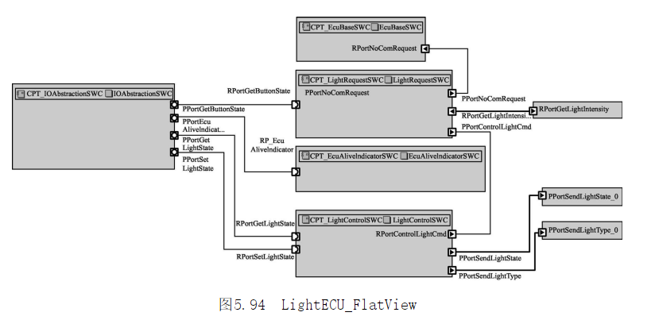
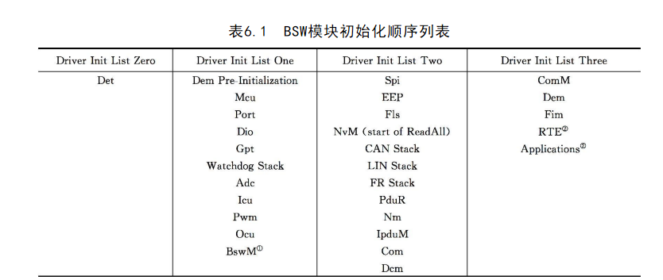
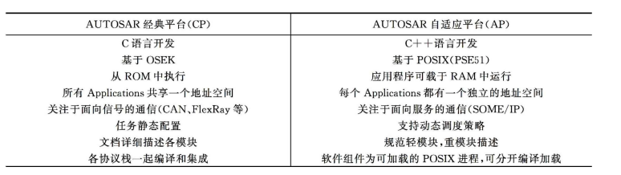

# AUTOSAR规范与车用控制器软件开发
<!-- TOC -->

- [1. 基础理论](#1-基础理论)
    - [1.1. AUTOSARd的原则及核心思想](#11-autosard的原则及核心思想)
    - [1.2. 分层架构](#12-分层架构)
        - [1.2.1. 应用软件层](#121-应用软件层)
            - [1.2.1.1. 软件组件](#1211-软件组件)
            - [1.2.1.2. 软件组件内部行为](#1212-软件组件内部行为)
        - [1.2.2. AUTOSAR运行时环境](#122-autosar运行时环境)
        - [1.2.3. 基础软件层（BSW）](#123-基础软件层bsw)
    - [1.3. AUTOSAR虚拟功能总线](#13-autosar虚拟功能总线)
    - [1.4. AUTOSAR方法论](#14-autosar方法论)
- [2. 本书实例：车灯控制](#2-本书实例车灯控制)
    - [2.1. 整体软件架构](#21-整体软件架构)
    - [2.2. 接口](#22-接口)
    - [2.3. 解决方案架构](#23-解决方案架构)
    - [2.4. 架构以及信号流示意图](#24-架构以及信号流示意图)
- [3. 软件组件级设计与开发](#3-软件组件级设计与开发)
    - [3.1. 所用的工具](#31-所用的工具)
    - [3.2. 软件组件模型开发及代码生成](#32-软件组件模型开发及代码生成)
    - [3.3. 在 Simulink 中导入软件组件描述文件——“自上而下”的工作流程](#33-在-simulink-中导入软件组件描述文件自上而下的工作流程)
- [4. 系统级设计与配置](#4-系统级设计与配置)
    - [4.1. ETAS ISOLAR-A工具简介](#41-etas-isolar-a工具简介)
    - [4.2. 基于ISOLAR-A的软件组件设计方法](#42-基于isolar-a的软件组件设计方法)
    - [4.3. 基于ISOLAR-A的系统级设计与配置方法](#43-基于isolar-a的系统级设计与配置方法)
- [5. ECU级开发之RTE与BSW](#5-ecu级开发之rte与bsw)
    - [5.1. 设计模块细分：](#51-设计模块细分)
    - [5.2. 所用工具](#52-所用工具)
    - [5.3. CAN通信协议栈](#53-can通信协议栈)
        - [5.3.1. 概念](#531-概念)
        - [5.3.2. 配置](#532-配置)
    - [5.4. ECUM模块概念与配置方法介绍](#54-ecum模块概念与配置方法介绍)
    - [5.5. BswM（ Basic Software Mode Manager）模块概念与配置方法介绍](#55-bswm-basic-software-mode-manager模块概念与配置方法介绍)
    - [5.6. BSW模块代码生成](#56-bsw模块代码生成)
    - [5.7. 服务软件组件与应用层软件组件端口连接](#57-服务软件组件与应用层软件组件端口连接)
    - [5.8. RTE配置与代码生成](#58-rte配置与代码生成)
    - [5.9. AUTOSAR操作系统概念与配置方法介绍](#59-autosar操作系统概念与配置方法介绍)
        - [5.9.1. 操作系统概念](#591-操作系统概念)
        - [5.9.2. OS配置方法](#592-os配置方法)
- [6. ECU级开发之MCAL](#6-ecu级开发之mcal)
- [7. Adaptive AUTOSAR](#7-adaptive-autosar)
    - [框图](#框图)
    - [新概念](#新概念)

<!-- /TOC -->
## 1. 基础理论
### 1.1. AUTOSARd的原则及核心思想
AUTOSAR联盟自成立至今，一直提倡“在标准上合作，在实现上竞争”的原则，标准大家共同制定，但具体的实现方法是由各公司自己去探索的。其核心思想在于“统一标准、分散实现、集中配置”。“统一标准”是为了给各厂商提供一个开放的、通用的平台；“分散实现”要求软件系统高度的层次化和模块化，同时还要降低应用软件与硬件平台之间的耦合；不同的模块可以由不同的公司去完成开发，但要想完成最终软件系统的集成，就必须将所有模块的配置信息以统一的格式集中整合并管理起来，从而配置生成一个完整的系统，这就是“集中配置”。

**ETAS公司的工具套件**
ETASAUTOSAR相关的产品主要包括以下内容。  
>①ISOLAR-A：软件架构设计工具，支持整车级软件架构的设计，可用于符合AUTOSAR规范的汽车嵌入式系统软件开发中的系统级开发。  
②ASCET：基于模型的AUTOSAR软件组件建模工具。  
③RTA系列：由RTA-RTE、RTA-BSW、RTA-OS组成，可用于AUTOSAR ECU级开发，即RTE与BSW的配置及代码生成。  
④ISOLAR-EVE：虚拟ECU验证平台。  

### 1.2. 分层架构

#### 1.2.1. 应用软件层

应用软件层（ApplicationSoftwareLayer，ASW）包含若干个软件组件（SoftwareComponent，SWC），软件组件间通过端口（Port）进行交互。每个软件组件可以包含一个或者多个运行实体（RunnableEntity，RE），运行实体中封装了相关控制算法，其可由RTE事件（RTEEvent）触发。

##### 1.2.1.1. 软件组件

**分类**如下：  
①应用软件组件（ApplicationSWC）  
②传感器/执行器软件组件（Sensor/ActuatorSWC）  
③标定参数软件组件（ParameterSWC）  
④ECU抽象软件组件（ECUAbstractionSWC）  
提供访问ECU具体I/O的能力。  
⑤复杂设备驱动软件组件（ComplexDeviceDriverSWC）  
⑥服务软件组件（ServiceSWC）。   

**端口分类**  
①需型端口：用于从其他软件组件获得所需数据或者所请求的操作。   
②供型端口：用于对外提供某种数据或者某类操作。  
③供需端口：兼有需型端口与供型端口的特性。

**端口接口分类**：  
①发送者-接收者接口（Sender-ReceiverInterface，S/R）；  
一个软件组件的多个需型端口、供型端口、供需端口可以引用同一个发送者-接收者接口，并且它们可以使用该接口中所定义的任意一个或者多个数据元素，而并不一定使用所有数据元素。   
可分为显示（Explicit）和隐式（Implicit）两种模式。能在运行实体运行之前先把数据读到缓存中，在运行实体运行结束后再把数据写出去，则可以改善运行效率，这就是隐式模式。  
 
②客户端-服务器接口（Client-ServerInterface，C/S）；  
客户端调用服务端提供的函数,分为**同步**和**异步**模式。    
   
  
③模式转换接口（ModeSwitchInterface）；  
④非易失性数据接口（Non-volatileDataInterface）；  
⑤参数接口（ParameterInterface）；  
⑥触发接口（TriggerInterface）。

##### 1.2.1.2. 软件组件内部行为
  
下面是一个不同的`RTE Event`触发对应运行实体的例子。  
  
以下是运行间实体变量示意：  

#### 1.2.2. AUTOSAR运行时环境
 RTE可以实现软件组件间、基础软件间以及软件组件与基础软件之间的通信。

#### 1.2.3. 基础软件层（BSW）
  
进一步打开，如下所示
  
进一步打开微控制器抽象层，如下图所示

### 1.3. AUTOSAR虚拟功能总线
AUTOSAR为了实现一种“自顶向下”的整车级别的软件组件定义，提出了虚拟功能总线（VirtualFunctionBus，VFB）的概念。VFB的真实通信实现可以由RTE和基础软件来保证，所以，RTE是AUTOSAR VFB的具体实现。

### 1.4. AUTOSAR方法论

  
  

## 2. 本书实例：车灯控制
### 2.1. 整体软件架构
  
### 2.2. 接口
  
### 2.3. 解决方案架构

### 2.4. 架构以及信号流示意图

## 3. 软件组件级设计与开发
### 3.1. 所用的工具
>　 Matlab/ Simulink  　 
Embedded Coder

### 3.2. 软件组件模型开发及代码生成

A 使用Simulink构造系统，使用Embedded coder给予Simulink构造的模型生成代码。

Simulink中的元素和AUTOSAR中对应关系如下：  
  
Simulink主要进行模式抽象的配置，通过图形化显示方式，配置出各个组件的模型框架，

B. 软件组件代码及描述文件配置生成

- Simulink-AUTOSAR Mapping  
主要将Simulink中所建模型的元素与AUTOSAR软件组件相关元素进行对应  

配置项 | 作用 | 
----|----|-
INports/Outports | 映射组件中的端口
Entry Point Functions | 映射组件中的运行实体runnable
Function Callers | 映射组件中的CLient端口
Data Transfers | 映射IRV

- AUTOSAR Properties  
配置与 AUTOSAR 软件组件相关的元素以及描述文件生成选项 

    - 配置端口接口S/R  
添加数据元素即可  
    - 配置端口接口C-S  
添加操作和参数  
    - 组件内部配置  
配置组件的端口(涉及 ReceiverPorts、 SenderPorts、 ClientPorts)、运行实体(Runnables)及其RTE事件、IRV设置   
    - XML Options（XML文件选项）配置  
这里建议Export XML file packaging选择Single file，这样描述文件基本可以集中生成在一个arxml中。

### 3.3. 在 Simulink 中导入软件组件描述文件——“自上而下”的工作流程

“自上而下”的工作流程有别于“自下而上”的工作流程，其需要先在AAT（ AUTOSAR Authoring Tool）工具（如ISOLAR-A）中完成软件组件框架设计，并将软件组件arxml描述文件导入Matlab/Simulink完成内部算法的实现，然后再通过Matlab/Simulink生成符合AUTOSAR规范的代码及arxml描述文件

## 4. 系统级设计与配置
### 4.1. ETAS ISOLAR-A工具简介

ISOLAR-A工具是ETAS公司专门为符合AUTOSAR规范的汽车嵌入式系统软件开发所推出的工具  
众所周知，在开发AUTOSAR系统时，软件架构设计是至关重要的。得益于博世集团在ECU开发过程中的技术沉淀及其与全球OEM的密切合作，ISOLAR-A工具是一款高效的AUTOSAR软件架构设计工具。
ISOLAR-A工具主要具有以下功能与特色：
>①可以进行整车级别的软件组件架构设计；  
②设计符合AUTOSAR规范的软件组件，包括软件组件端口、端口接口、运行实体等的设计，还可以导入/导出软件组件arxml描述文件，并支持与其他基于模型的设计（ModelBasedDesign，MBD）开发工具协同开发，如ETASASCET、Matlab/Simulink，它们之间可以通过arxml描述文件进行软件组件信息交互；  
③导入传统格式的文件，如DBC（包括SAEJ1939和ISOBUS11783）、FIBEX、LDF（包括SAEJ2602）和ODX等，自动化地完成这些大工作量的任务，不仅可以提高开发效率，而且还可以减少开发错误；  
④可以进行AUTOSAR系统级设计，并可为单核或多核ECU完成系统以及ECU信息抽取工作；  
⑤可以集成AUTOSAR系统和应用软件；  
⑥采用标准的AUTOSARXML文件格式（arxml），很容易连接到SVN等软件配置和版本管理系统等。作为ETAS整体AUTOSAR解决方案的一部分，ISOLAR-A可与ETAS和其他供应商的AUTOSAR工具进行集成。特别是ETAS的RTA-RTE（AUTOSAR运行环境生成器）和RTA-OS（操作系统），还可以集成AUTOSAR-R4.x的基础软件，如ETASRTA-BSW。

### 4.2. 基于ISOLAR-A的软件组件设计方法
工程文件夹目录说明：
>与软件组件描述（Software Component Description）相关的元素都在Software文件夹中；
与系统描述（SystemDescription）相关的元素都在System文件夹中；
与ECU描述（ECUDescription）相关的元素都在Bsw文件夹中。

- 数据类型定义  
    - 创建数据类型  
    - 创建与该数据类型对应的计算方法  

- 端口接口设计  
    - 为端口接口创建一个arxml描述文件以及package
package是arxml描述文件中的一个概念；
    - 发送者-接收者类型接口设计  
添加数据元素的名字、类型
    - 客户端-服务器类型接口设计  
添加接口的操作(operation)以及参数(ArgumentData)

- 软件组件设计
    - 为软件组件创建一个arxml描述文件以及package, 添加一个应用软件组件
    - 添加端口  
    - 软件组件内部行为设计 

主要工作如下:  
>①创建软件组件内部行为（InternalBehaviour）；  
②添加运行实体（Runnable）；  
③添加运行实体与所属软件组件的端口访问（PortAccess）；  
④添加运行实体的RTE事件（RTEEvent）；  
⑤添加运行实体间变量（InterRunnableVariable，IRV）；  
⑥建立并添加数据类型映射（DataTypeMapping）。

软件组件设计完成后生成对应的arxml文件，这个文件记录了以上所有配置信息。

- IO硬件抽象层组件设计    
**作用**
IOAbstractionSWC 软件组件作为应用层软件组件与微控制器抽象层进行交互的桥梁，需要定义若干服务运行实体（ServerRunnable），这样应用层软件组件通过引用Client/Server端口接口的端口作为Client就可以调用Server端的操作，实现对MCAL接口的调用。该部分的实现和一般SWC的定义类似，需要设计端口、端口接口等软件组件中所包含的元素，运行实体中的代码需要**手动编写**，从而来实现对微控制器抽象层（MCAL）相关接口的调用。

- 软件组件模板生成  
在设计完各软件组件之后，可以生成软件组件模板，之后可以往各运行实体函数框架中填入相应算法。在这里我们进行编码。

### 4.3. 基于ISOLAR-A的系统级设计与配置方法
- 系统配置输入文件创建与导入
>①软件组件描述文件；  
②ECU资源描述文件；  
③系统约束描述文件:描述了总线信号等信息，如可用一个DBS文件描述CAN网络的拓扑结构。

- 介绍一个DBS文件的创建过程：
    - 定义网络
    - 定义网络节点
    - 完成signal和Message的设计
        - signal
        主要是长度、字节顺序等信息
        - Message
        CAN协议的报文信息：CAN帧、ID、DLC（报文长度）
    - 将各报文添加到相应节点

- Composition SWC建立 
如前所述，AUTOSAR软件组件大体上可分为原子软件组件（Atomic SWC）和部件（Composition SWC）。部件虽然也属于软件组件的范畴，但其建立方法和思想与原子软件组件有所不同。
建立完Composition之后，整个车灯控制系统的整体软件架构也就建立起来了。

- 系统配置  
    - 新建一个系统配置，为其添加一个Compositon，也就是在上面建立的VehicleComposition。  
    - 接着完成软件组件到ECU的映射（SWC To ECU Mapping）——这就是AUTOSAR方法论中所提出的从整车级的软件组件定义过渡到具体ECU开发的关键环节。  
    - 在这里把几个组件的逻辑功能整合到一个ECU中。
 在系统配置阶段还需要完成系统信号与端口数据元素的映射，即System Data Mapping。

- ECU信息提取（ ECU Extract）  
提取结果如下图所示：  

## 5. ECU级开发之RTE与BSW
### 5.1. 设计模块细分：
- **系统服务层**:  
>操作系统（Operating System，OS）、基础软件模式管理器（Basic Software Mode Manager，BswM）、ECU状态管理器（ECU State Manager， EcuM）、 通信管理模块（Communication Manager，ComM）；  

把系统服务层打开，如下图所示：  
  

- **通信服务**:  
>通信模块（Communication，Com）、CAN状态管理模块（CAN State Manager，CanSM）、协议数据单元路由模块（PDURouter，PduR）；ECU抽象层中的I/O硬件抽象，通信硬件抽象中的CAN接口模块（CAN Interface，CanIf）；  

- **微控制器抽象层**:  
>MCU驱动、GPT驱动，通信驱动中的CAN驱动，I/O驱动中PORT驱动、DIO驱动、ADC驱动、PWM驱动、ICU驱动。

### 5.2. 所用工具
- RTA-BSW
- RTA-RTE
- RTA-OS  
RTA-OS以ETAS推出多年的RTA-OSEK实时操作系统开发经验为基础，它可用于单核与多核单片机，并且资源开销小。由于其通过了ISO 26262 ASIL-D的认证，可以被用于安全要求苛刻的控制器。

### 5.3. CAN通信协议栈

#### 5.3.1. 概念
  
流程：  
①Com模块获取应用层的信号（Signal），经一定处理封装为I-PDU（Interaction Layer Protocol Data Unit）发送到PduR模块；   
②PduR根据路由协议中所指定的I-PDU目标接收模块，将接收到的I-PDU经一定处理后发送给CanIf；  
③CanIf将信号以L-PDU（Data LinkLayer Protocol Data Unit）的形式发送给CAN驱动模块。

#### 5.3.2. 配置
模块 | 作用 | 配置项
---|----|----
EcuC | 收集全局PDU的配置信息 | 长度
Com | 获取应用层的信号（Signal），经一定处理封装为I-PDU发送到PduR模块 | ComIPduGroups、ComSignal
PduR | 为通信接口模块、传输协议模块、诊断通信管理模块以及通信模块提供基于I-PDU的路由服务。 | 添加所用到的通信协议栈中的相关模块(PduRBswModules)、定义路由路径（ PduRRoutingPaths）
CanIf | 访问CAN总线的标准接口。 | 配置硬件对象句柄句柄（ Hardware object handle， Hoh）,完成PDU向MB的分配。
ComM | 可以简化总线通信栈的初始化、网络管理等，并可收集/协调总线通信访问请求。 | 配置通信模式、周期
CanSM | 负责实现CAN网络控制流程的抽象，它为ComM模块提供API来请求CAN网络进行通信模式的切换， | 配置周期

### 5.4. ECUM模块概念与配置方法介绍
EcuM模块负责初始化（Initialize）和反初始化（De-initialize）一些BSW模块。
配置ECU睡眠模式（Sleep Modes）、下电原因（Shutdown Causes）、复位模式（Reset Modes），管理所有ECU唤醒源（Wakeup Sources）。  

配置各个模式的short name 和 ID 的映射关系。

**初始化列表**  
  
列表0和1在操作系统OS启动之前完成，而列表2和3则需要操作系统OS支持，故在其启动之后完成。对于Flexible模式，EcuM只需要完成列表0和1中各模块的初始化，而后两个列表中的模块初始化需要由BswM模块来实现。初始化列表中定义了各种初始化函数，这些初始化函数调用MCAL层的函数实现各种初始化。  

### 5.5. BswM（ Basic Software Mode Manager）模块概念与配置方法介绍

 
两大作用：  
- 模式仲裁（以下三种情况下发生）
    - 软件组件发出模式切换请求
    - EcuM等BSW模块的模式标识发生变化
    - 周期性调用BswM_ MainFunction（）函数
- 模式控制
    执行一些预定义的标准动作

以应用层EcuBaseSWC发起启动/关闭CAN通信请求为例介绍配置流程

- BswMModeRequestPort 配置
建立一个与应用层SWC交互的服务端口，为该端口进行属性定义。由于该端口和应用层SWC交互，所以这里新建一个BswMGenericRequest，其请求类型RequestType为SWC，并且一共有两种模式（启动/关闭CAN通信），即配置BswMRequestedModeMax为2。  
- ModeCondition 与 LogicalExpression 配置  
- Action 与 ActionList 配置
- Rule 配置

### 5.6. BSW模块代码生成
### 5.7. 服务软件组件与应用层软件组件端口连接
### 5.8. RTE配置与代码生成
A. RTE Contract 阶段生成  
输入文件是软件组件描述文件，其输出文件为一些“.h”文件，主要包括类型定义和接口定义信息，

B. RTE 配置  
- ECU级模块配置信息收集
- 运行实体到操作系统任务映射  
操作系统无法直接调度运行实体，而是需要通过将运行实体映射到不同的任务中，通过对任务进行调度进而实现各个特定的时刻执行特定的运行实体。
- RTE Generation 阶段生成  
  

### 5.9. AUTOSAR操作系统概念与配置方法介绍
#### 5.9.1. 操作系统概念
- 计数器与报警器  
当到达报警器相对应的计数器设定值时，可激活一个任务、设置一个事件或调用一个回调函数。  
- 调度表
- 中断处理  
任务的优先级低于中断的优先级，即最低优先级的中断可以打断最高优先级的任务。
    - 一类中断——不能使用操作系统的服务
    - 二类中断——可以使用一部分操作系统提供的服务
- 资源管理  
采用优先级上限协议  
- 自旋锁
- 一致类(Conformance Class)
TYPE | 说明
-----|---
BCC1 | 每个优先级只有一个任务，基本任务的激活数只能为一次，仅支持基本任务。
BCC2 | 每个优先级可有多个任务，基本任务的激活数可为多次，仅支持基本任务。
ECC1 | 每个优先级只有一个任务，基本任务的激活数只能为一次，支持基本任务和扩展任务。
ECC2 | 每个优先级可有多个任务，基本任务的激活数可为多次，支持基本任务和扩展任务。

- 可扩展性等级

#### 5.9.2. OS配置方法
- 导入[5.8. RTE配置与代码生成](#58-rte配置与代码生成)中生成的OS相关arxml文件  
- 设置[5.9.1. 操作系统概念](#591-操作系统概念)中提到过的计数器基准  
- 配置ISR(中断服务程序)
- 设置调度表[5.9.1. 操作系统概念](#591-操作系统概念)
- 配置Task
- 编译

## 6. ECU级开发之MCAL
## 7. Adaptive AUTOSAR
### 框图  
  
AP和CP的对比：  

### 新概念
- 自适应平台基础
- 自适应应用
- 虚拟地址空间
- 面向服务的通信

   

